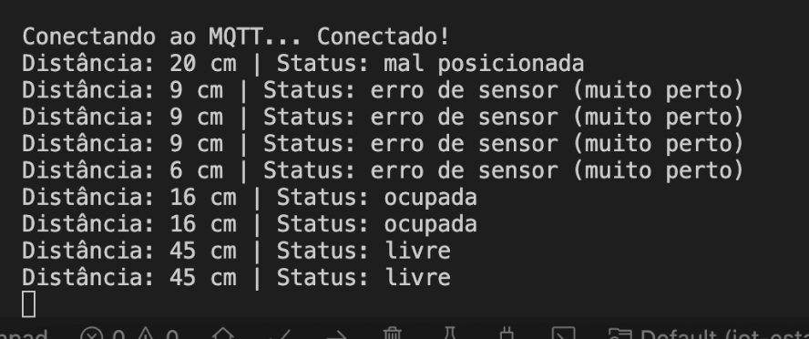
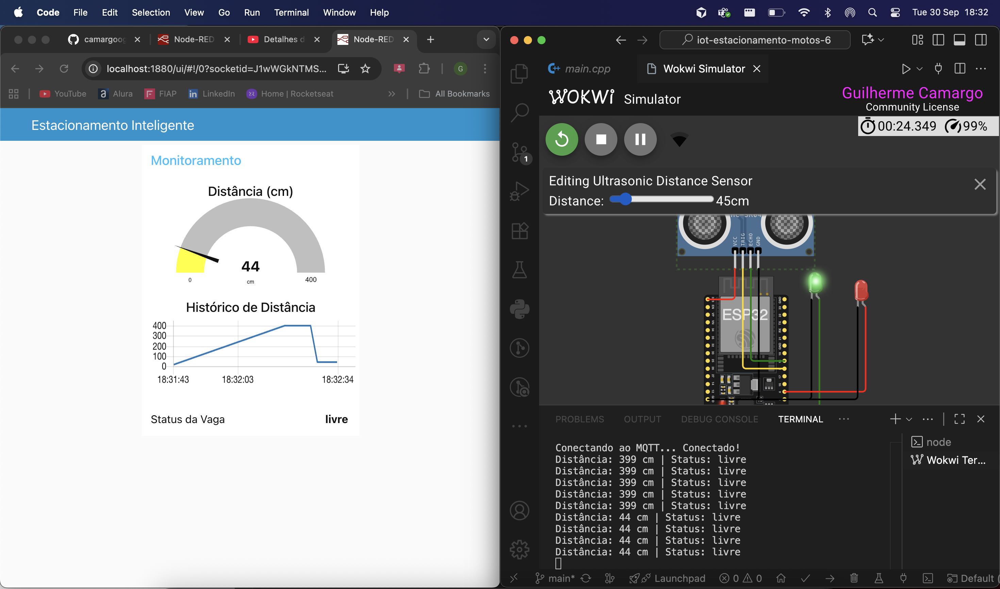
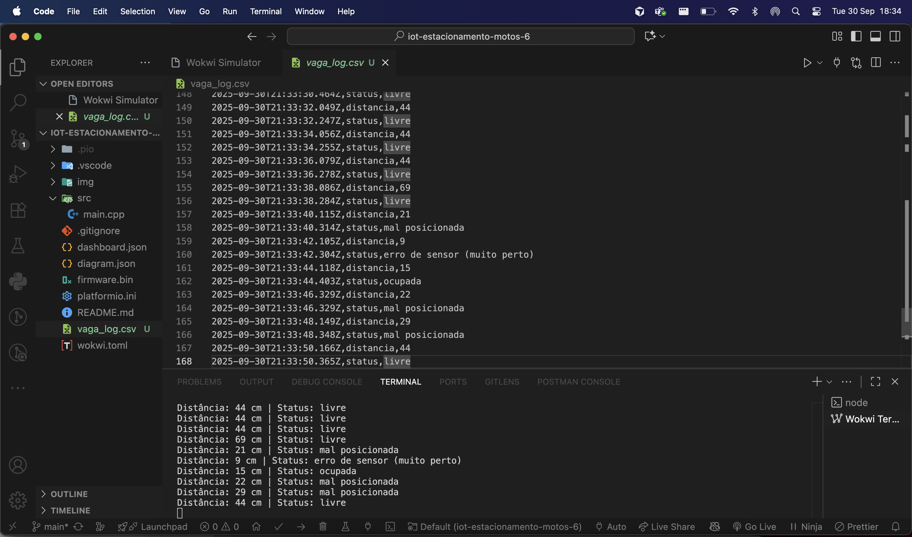

# Sistema IoT de Monitoramento de Estacionamento para Motos

## 📋 Descrição do Problema

Em estacionamentos de motos, é comum a dificuldade de identificar rapidamente vagas livres e ocupadas. Este projeto propõe uma solução IoT completa para monitoramento em tempo real, facilitando a gestão e o uso eficiente das vagas com indicadores visuais e dados históricos.

## 🎯 Solução Proposta

O sistema utiliza um ESP32 equipado com sensor ultrassônico (HC-SR04) e LEDs indicadores para detectar e comunicar o status da vaga. Os dados são enviados via MQTT para um dashboard Node-RED que exibe informações em tempo real, histórico e logs para análise.

## ⚡ Funcionalidades Principais

- **🔗 Conexão Wi-Fi**: Conecta automaticamente à rede Wi-Fi
- **📡 Sensor Ultrassônico**: Mede distância com precisão para detecção de ocupação
- **💡 LEDs Indicadores**: 
  - LED Verde: Vaga livre ou mal posicionada
  - LED Vermelho: Vaga ocupada ou erro de sensor
- **📊 Comunicação MQTT**: Publica status e distância em tópicos dedicados
- **📈 Dashboard Node-RED**: 
  - Gauge de distância em tempo real
  - Gráfico histórico de distâncias
  - Status textual da vaga
  - Log automático em CSV
- **🎮 Simulação Completa**: Teste no Wokwi sem hardware físico

## 🧠 Lógica de Ocupação Realista da Vaga

O sistema implementa uma lógica inteligente que considera diferentes cenários de ocupação:

### Faixas de Distância e Status:

- **< 10cm**: `"erro de sensor (muito perto)"` 🔴
  - LED Vermelho ligado, Verde desligado
  - Indica possível erro de medição ou objeto muito próximo

- **10-20cm**: `"ocupada"` 🔴
  - LED Vermelho ligado, Verde desligado
  - Moto detectada na vaga

- **20-35cm**: `"mal posicionada"` 🟢🔴
  - Ambos LEDs ligados
  - Moto presente mas mal estacionada

- **≥ 35cm**: `"livre"` 🟢
  - LED Verde ligado, Vermelho desligado
  - Vaga disponível

### Vantagens desta Lógica:
- **Detecção de erros**: Evita falsos positivos por objetos muito próximos
- **Feedback visual**: LEDs indicam status instantaneamente
- **Mal posicionamento**: Identifica motos mal estacionadas
- **Tolerância**: Margem de segurança para diferentes tamanhos de moto

## 🛠️ Tecnologias Utilizadas

### Hardware (Simulado no Wokwi):
- **ESP32 DevKit C v4**: Microcontrolador com Wi-Fi integrado
- **Sensor HC-SR04**: Sensor ultrassônico para medição de distância
- **LED Verde**: Indicador de vaga livre/mal posicionada
- **LED Vermelho**: Indicador de vaga ocupada/erro

### Software e Protocolos:
- **Arduino Framework**: Desenvolvimento do firmware
- **WiFi.h**: Conexão sem fio
- **PubSubClient**: Cliente MQTT
- **MQTT**: Protocolo de comunicação IoT
- **HiveMQ**: Broker MQTT público
- **Node-RED**: Plataforma de desenvolvimento visual
- **Node-RED Dashboard**: Interface web responsiva

### Ferramentas de Desenvolvimento:
- **PlatformIO**: IDE e framework para desenvolvimento IoT
- **VSCode**: Editor de código com extensão PlatformIO
- **Wokwi**: Simulador online de circuitos Arduino/ESP32
- **Git**: Controle de versão

## 📋 Pré-requisitos

### Para Desenvolvimento Local (VSCode):
- **VSCode** instalado
- **Extensão PlatformIO** para VSCode
- **Git** para clonar o repositório

### Para Simulação Online:
- Conta no **Wokwi**
- **Node.js** e **Node-RED** instalados
- Broker MQTT público (ex: HiveMQ)

## 👥 Integrantes

- **RM556270** - Bianca Vitoria - 2TDSPZ
- **RM555166** - Guilherme Camargo - 2TDSPM  
- **RM555131** - Icaro Americo - 2TDSPM

## 🚀 Instruções de Uso

### Opção 1: Desenvolvimento Local no VSCode (Recomendado)

#### 1. Configuração do Ambiente
```bash
# Clone o repositório
git clone https://github.com/seu-usuario/iot-estacionamento-motos-7.git
cd iot-estacionamento-motos-7

# Abra no VSCode
code .
```

#### 2. Instalação da Extensão PlatformIO
1. Abra o VSCode
2. Vá em **Extensions** (Ctrl+Shift+X)
3. Pesquise por **"PlatformIO IDE"**
4. Instale a extensão oficial
5. Reinicie o VSCode

#### 3. Configuração do Projeto
1. O PlatformIO detectará automaticamente o arquivo `platformio.ini`
2. As dependências serão instaladas automaticamente:
   - `knolleary/PubSubClient @ ^2.8`

#### 4. Compilação e Upload
```bash
# Compilar o projeto
pio run

# Upload para ESP32 (se conectado)
pio run --target upload

# Monitor serial
pio device monitor
```

### Opção 2: Simulação Online no Wokwi

#### 1. Configuração do Circuito
- Importe o código `main.cpp` para o Wokwi
- Importe o arquivo `diagram.json` para montar o circuito automaticamente
- Ou siga a imagem abaixo para montar manualmente:


#### 2. Componentes e Conexões
**Componentes utilizados:**
- **ESP32 DevKit C v4**: Microcontrolador com Wi-Fi integrado
- **Sensor HC-SR04**: Mede distância usando ultrassom
- **LED Verde**: Indicador de vaga livre/mal posicionada (GPIO 2)
- **LED Vermelho**: Indicador de vaga ocupada/erro (GPIO 4)

**Conexões:**
- **VCC (vermelho)**: 3V3 do ESP32 → VCC do HC-SR04
- **GND (preto)**: GND do ESP32 → GND do HC-SR04  
- **TRIG (amarelo)**: GPIO 5 → TRIG do HC-SR04
- **ECHO (verde)**: GPIO 18 → ECHO do HC-SR04
- **LED Verde**: GPIO 2 → Anodo, GND → Catodo
- **LED Vermelho**: GPIO 4 → Anodo, GND → Catodo

#### 3. Instalação da Biblioteca PubSubClient
1. No Wokwi, clique em **Libraries** (ícone de livro)
2. Pesquise por **"PubSubClient"**
3. Clique em **Install** na biblioteca oficial
4. Aguarde a instalação completar

#### 4. Execução da Simulação
1. Clique em **▶️ Start Simulation**
2. Observe o Serial Monitor para logs de conexão
3. Movimente objetos próximos ao sensor para testar

### Configuração do Dashboard Node-RED

#### 1. Instalação do Node-RED Dashboard
```bash
# Instalar Node-RED globalmente
npm install -g node-red

# Executar Node-RED
node-red
```

#### 2. Configuração do Dashboard
1. Acesse [http://localhost:1880](http://localhost:1880)
2. Clique em **Menu** → **Manage palette**
3. Na aba **Install**, pesquise por `node-red-dashboard`
4. Clique em **Install**

#### 3. Importação do Fluxo
1. Clique em **Menu** → **Import**
2. Cole o conteúdo do arquivo `dashboard.json`
3. Clique em **Import** e depois **Deploy**

#### 4. Configuração do Broker MQTT
- Broker: `broker.hivemq.com`
- Porta: `1883`
- Client ID: deixe em branco (gerado automaticamente)

#### 5. Acesso ao Dashboard
- Dashboard: [http://localhost:1880/ui](http://localhost:1880/ui)
- Interface Node-RED: [http://localhost:1880](http://localhost:1880)

## 📡 Tópicos MQTT Utilizados

- **`fiap/iot/vaga/status`**: Status da vaga (livre/ocupada/mal posicionada/erro)
- **`fiap/iot/vaga/distancia`**: Distância medida pelo sensor em centímetros

## 📊 Resultados Parciais

### 📸 Prints Importantes

#### 1. Circuito Montado no Wokwi


#### 2. Fluxo Node-RED Configurado


#### 3. Dashboard em Funcionamento


#### 4. Monitor Serial com Logs


#### 5. Sistema Funcionando em Tempo Real


#### 6. Log csv


### 📋 Como Tirar Prints Importantes

#### Para Documentar o Projeto:

1. **Print do Circuito Wokwi:**
   - Execute a simulação no Wokwi
   - Use `Ctrl+Shift+P` → "Take Screenshot" ou ferramenta de captura do navegador
   - Salve como `circuito-wokwi.png`

2. **Print do Dashboard Node-RED:**
   - Acesse [http://localhost:1880/ui](http://localhost:1880/ui)
   - Aguarde dados chegarem do ESP32
   - Capture a tela completa do dashboard
   - Salve como `dashboard.png`

3. **Print do Monitor Serial:**
   - No VSCode: `pio device monitor`
   - No Wokwi: Serial Monitor
   - Capture logs de conexão e dados
   - Salve como `monitor-serial.png`

4. **Print do Fluxo Node-RED:**
   - Acesse [http://localhost:1880](http://localhost:1880)
   - Capture o fluxo completo
   - Salve como `fluxo-node-red.png`

5. **Print do Sistema Funcionando:**
   - Abra dashboard e Wokwi lado a lado
   - Movimente objeto no Wokwi
   - Capture ambos atualizando simultaneamente
   - Salve como `dash-wokwi-temporeal.png`

### 🎯 Funcionalidades Demonstradas

- ✅ **Conexão Wi-Fi**: ESP32 conecta automaticamente
- ✅ **Detecção de Distância**: Sensor HC-SR04 funcionando
- ✅ **LEDs Indicadores**: Feedback visual em tempo real
- ✅ **Comunicação MQTT**: Dados publicados corretamente
- ✅ **Dashboard Responsivo**: Interface web atualizando
- ✅ **Logging Automático**: Dados salvos em CSV
- ✅ **Lógica Inteligente**: Diferentes status de ocupação

## 🎥 Vídeo Demonstrativo

[Link para o vídeo no YouTube](https://youtu.be/DDRDllUFeqA?si=YxhqVT8EaGnbJM8L)

## 📝 Logs e Dados

O sistema gera automaticamente um arquivo `vaga_log.csv` com:
- Timestamp ISO
- Tipo de dado (status/distancia)
- Valor medido

Exemplo de log:
```csv
2024-01-15T10:30:00.000Z,distancia,25
2024-01-15T10:30:00.000Z,status,livre
2024-01-15T10:30:05.000Z,distancia,15
2024-01-15T10:30:05.000Z,status,ocupada
```

## 🔧 Troubleshooting

### Problemas Comuns:

1. **ESP32 não conecta ao Wi-Fi:**
   - Verifique credenciais no código
   - Confirme se a rede está disponível

2. **MQTT não conecta:**
   - Verifique conexão com internet
   - Teste broker alternativo

3. **Dashboard não atualiza:**
   - Confirme se Node-RED está rodando
   - Verifique se fluxo foi importado corretamente

4. **Sensor não detecta:**
   - Verifique conexões no circuito
   - Teste com objetos em diferentes distâncias
