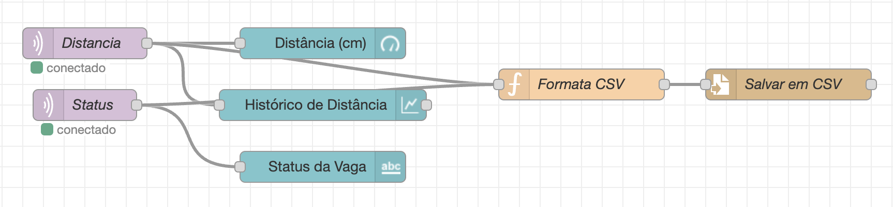

# Sensor de Estacionamento de Moto com ESP32, MQTT, Wokwi e Dashboard Node-RED

## Descrição do Problema

Em estacionamentos de motos, é comum a dificuldade de identificar rapidamente vagas livres e ocupadas. Este projeto propõe uma solução IoT para monitoramento em tempo real, facilitando a gestão e o uso eficiente das vagas.

## Solução Proposta

O sistema utiliza um ESP32 simulado no Wokwi, equipado com um sensor ultrassônico (HC-SR04) para detectar a presença de uma moto. Os dados são enviados via MQTT para um dashboard Node-RED, que exibe a distância e o status da vaga em tempo real.

## Funcionalidades

- **Conexão Wi-Fi**: O ESP32 conecta-se automaticamente à rede Wi-Fi simulada.
- **Sensor Ultrassônico**: Mede a distância até a moto para determinar se a vaga está ocupada (< 20cm) ou livre (>= 20cm).
- **Comunicação MQTT**: Publica o status da vaga e a distância medida em tópicos MQTT.
- **Dashboard Node-RED**: Visualização em tempo real dos dados, com gauge, gráfico e status textual.
- **Simulação no Wokwi**: Teste completo sem necessidade de hardware físico.

## Tecnologias Utilizadas

- ESP32 (simulado no Wokwi)
- Sensor HC-SR04
- MQTT (broker público HiveMQ)
- Node-RED (dashboard)
- PlatformIO + VSCode

## Pré-requisitos

- Visual Studio Code
- PlatformIO IDE
- Conta no Wokwi
- Node.js e Node-RED instalados
- Broker MQTT público (ex: HiveMQ)

## Instalação e Execução

### 1. Clone este repositório
```sh
git clone https://github.com/camargoogui/iot-estacionamento-motos
```

### 2. Abra no VSCode e compile com PlatformIO

### 3. Simule no Wokwi
- Importe o código para o Wokwi.
- Monte o circuito conforme a imagem abaixo:
  - VCC (vermelho) → 3V3 do ESP32
  - GND (preto) → GND do ESP32
  - TRIG (amarelo) → GPIO 5 do ESP32
  - ECHO (verde) → GPIO 18 do ESP32

### 4. Configure o Node-RED e o Dashboard
- **Instale o Node-RED Dashboard:**
  1. No Node-RED, clique no menu (três linhas no canto superior direito) > **Manage palette**.
  2. Vá até a aba **Install**.
  3. Pesquise por `node-red-dashboard` e clique em **Install**.
- Importe o fluxo do dashboard:
  1. No Node-RED, clique em Menu > Import.
  2. Cole o conteúdo do arquivo `dashboard.json` deste repositório.
  3. Clique em Import e depois em Deploy.
- Configure o broker MQTT como `broker.hivemq.com`, porta `1883`.
- Acesse o dashboard em [http://localhost:1880/ui](http://localhost:1880/ui).

### 5. Teste o sistema
- Movimente o objeto no Wokwi para simular a presença/ausência da moto.
- Veja o status e a distância mudando no dashboard em tempo real.

## Tópicos MQTT utilizados

- **Status da vaga:** `fiap/iot/vaga/status`
- **Distância:** `fiap/iot/vaga/distancia`

## Prints

**Circuito no Wokwi:**


**Fluxo Node-RED:**


**Dashboard Node-RED:**


## Vídeo

[Link para o vídeo no YouTube (não listado)](COLE_O_LINK_AQUI)